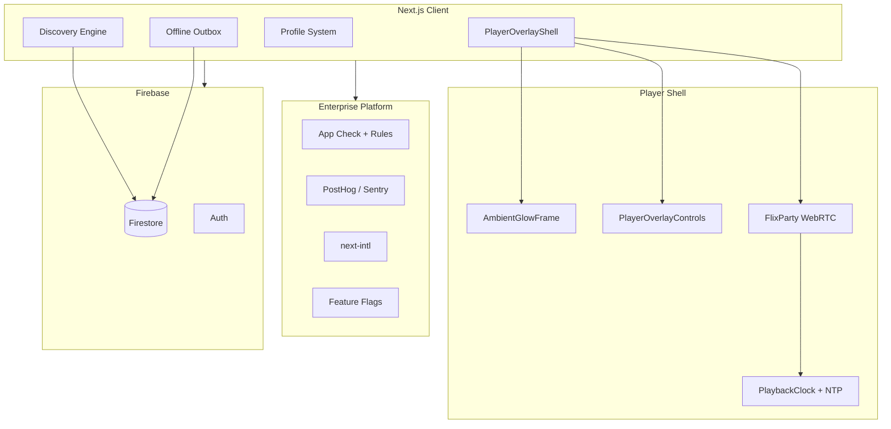
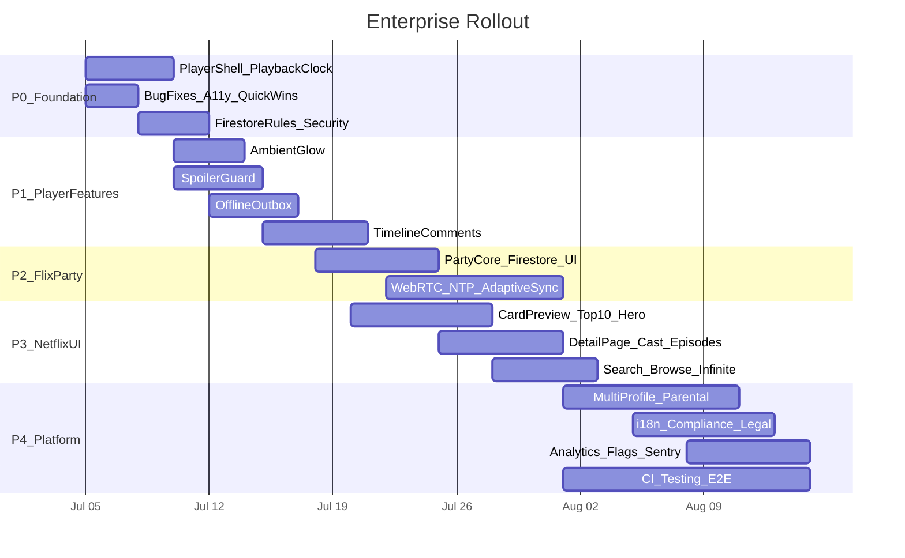

# FlixVerse Enterprise Master Plan

## Vision

Transform FlixVerse from a strong streaming discovery app into an **enterprise-grade platform** that exceeds Netflix in: cinematic player UX, social co-watching, personalization depth, accessibility, compliance, and observability — while staying **keyless and serverless** (Next.js 16 + Firebase + client WebRTC).

---

## Architecture overview



---

# PART A — Core Player Features (Original 5 + Shell)

## Phase 0 — Foundation (blocks Features 2 & 3)

Split [`VideoPlayer.tsx`](src/components/VideoPlayer.tsx) (634 lines) into:

| File | Role |
|------|------|
| [`src/components/player/PlayerShell.tsx`](src/components/player/PlayerShell.tsx) | Orchestrator |
| [`src/components/player/EmbedFrame.tsx`](src/components/player/EmbedFrame.tsx) | iframe + load/error |
| [`src/components/player/PlayerChrome.tsx`](src/components/player/PlayerChrome.tsx) | Header + transport |

Create [`src/hooks/player/usePlaybackClock.ts`](src/hooks/player/usePlaybackClock.ts):
- rAF-based interpolation; wire unused `totalDuration` / `resumePosition` from [`MovieDetails.tsx`](src/components/MovieDetails.tsx)
- Persist progress to [`useWatchHistory`](src/hooks/useWatchHistory.ts) on interval (closes gap: clock exists but history not updated during playback)

Extend [`src/integrations/firebase/types.ts`](src/integrations/firebase/types.ts) with all new schemas.

---

## Feature 1 — Cinematic Ambient Backlight

| File | Role |
|------|------|
| [`src/lib/player/extractDominantColors.ts`](src/lib/player/extractDominantColors.ts) | Canvas median-cut → top 4 colors |
| [`src/hooks/player/useDominantColors.ts`](src/hooks/player/useDominantColors.ts) | `requestIdleCallback`; sessionStorage cache |
| [`src/components/player/AmbientGlowFrame.tsx`](src/components/player/AmbientGlowFrame.tsx) | Multi-layer radial gradients, `blur-[120px]`, `pulseGlow` |

**Enterprise enhancements:**
- Scene cross-fade on episode switch (800ms)
- [`useReducedMotion`](src/hooks/useReducedMotion.ts) static fallback
- Genre/TMDB color fallback if canvas taints
- Sync glow palette to **Top 10 row** and **hero banner** accents site-wide (design cohesion)
- User toggle persisted in `localStorage`; respect system `prefers-color-scheme`

Replace static `.player-ambient` in [`globals.css`](src/app/globals.css) line ~903.

---

## Feature 2 — FlixParty (Hybrid WebRTC + Firestore)

**Constraint:** Cross-origin embeds cannot report true playback time. Host drives canonical clock; guests align via WebRTC + URL seek injection.

### Firestore schema

`flix_parties/{partyId}` + subcollections `messages/`, `signals/`

```typescript
interface FlixPartyRoom {
  id: string;
  code: string;
  hostId: string;
  encryptedPayload: string; // AES-GCM — TMDB id, season, episode, server
  playbackState: 'playing' | 'paused';
  lastKnownTime: number;
  serverIndex: number;
  updatedAt: number;
  participants: Array<{ userId: string; displayName: string; avatarUrl: string; lastSeenAt: number; role: 'host' | 'guest' }>;
}
```

### Phase 1 — WebRTC signaling via Firestore

[`src/lib/player/webrtcSignaling.ts`](src/lib/player/webrtcSignaling.ts), [`src/hooks/player/useWebRTCSync.ts`](src/hooks/player/useWebRTCSync.ts), [`src/hooks/player/useFlixParty.ts`](src/hooks/player/useFlixParty.ts)

DataChannel protocol: `play | pause | seek | server | ping | pong`

### Phase 2 — NTP clock calibration

[`src/lib/player/ntpClockSync.ts`](src/lib/player/ntpClockSync.ts) — offset `(T1-T0 + T2-T3) / 2`

### Phase 3 — Buffering diagnostics (heuristic)

[`src/hooks/player/useBufferingDiagnostics.ts`](src/hooks/player/useBufferingDiagnostics.ts) — Network Information API, visibility, rAF frame drops

### Phase 4 — Adaptive re-sync

[`src/lib/player/embedSeekUrls.ts`](src/lib/player/embedSeekUrls.ts) — soft drift 3–8s, hard resync >8s via VidLink `&start=` / VidSrc `&t=`

### Phase 5 — Web Crypto room privacy

Room key in URL hash fragment; encrypted payload in Firestore only

### FlixParty UI

[`FlixPartySidebar.tsx`](src/components/player/FlixPartySidebar.tsx), [`FlixPartyInviteDialog.tsx`](src/components/player/FlixPartyInviteDialog.tsx) (QR + Web Share API), [`SyncStatusBadge.tsx`](src/components/player/SyncStatusBadge.tsx)

Entry: [`MovieDetails.tsx`](src/components/MovieDetails.tsx) hero + player header + [`CommandPalette.tsx`](src/components/CommandPalette.tsx)

**Enterprise enhancements:**
- Firestore fallback when WebRTC/NAT fails (automatic downgrade)
- Host transfer on disconnect (promote longest-present guest)
- Room TTL auto-close after 24h idle; signal doc cleanup
- Rate limit: max 20 participants, 60 chat messages/min/user
- Emoji reactions on chat messages (lightweight, no new infra)
- **Public party lobby** page: `/party/join?code=XXXXXX`

Update [`firestore.rules`](firestore.rules) for `flix_parties`, `timeline_comments`, reports.

---

## Feature 3 — Timeline Comments & Marker Layer

Collection: `timeline_comments/{id}` — index `(tmdbId, timestampSeconds)`

| File | Role |
|------|------|
| [`src/hooks/player/useTimelineComments.ts`](src/hooks/player/useTimelineComments.ts) | Real-time CRUD |
| [`src/components/player/PlayerOverlayControls.tsx`](src/components/player/PlayerOverlayControls.tsx) | Scrubber + markers + heatmap |
| [`src/components/player/TimelineCommentPopup.tsx`](src/components/player/TimelineCommentPopup.tsx) | Corner card at marker crossing |

**Enterprise enhancements:**
- Comment density heatmap under scrubber
- Marker clustering on mobile (<5s merge)
- "Comment at this moment" Radix Popover
- **Spoiler-safe timeline comments** — hide markers beyond user's TV progress (integrates Feature 4)
- Moderation: report timeline comment → `reports/` collection
- Trending moments rail on detail page ("Most commented scenes")

---

## Feature 4 — Progressive Spoiler Guard

| File | Role |
|------|------|
| [`src/lib/spoiler/episodeProgress.ts`](src/lib/spoiler/episodeProgress.ts) | S/E progress math |
| [`src/hooks/spoiler/useSpoilerProgress.ts`](src/hooks/spoiler/useSpoilerProgress.ts) | Watch history integration |
| [`src/components/spoiler/SpoilerProtectedEpisode.tsx`](src/components/spoiler/SpoilerProtectedEpisode.tsx) | Blur + reveal |

**Integration:** [`MovieDetails.tsx`](src/components/MovieDetails.tsx) episode grid, [`ReviewSection.tsx`](src/components/ReviewSection.tsx) (phase 2), [`ProfileSettings.tsx`](src/components/ProfileSettings.tsx) toggle

**Enterprise enhancements:**
- Per-series reveal memory (`localStorage`)
- Franchise/sequel spoiler masking via TMDB collection IDs
- Kid profile: stricter spoiler defaults (ties to Part B profiles)
- Accessibility: explicit click-to-reveal, never hover-only on touch

---

## Feature 5 — Offline PWA Sync Outbox

Upgrade [`offlineStorage.ts`](src/lib/offlineStorage.ts) to **v2** with `offline_sync_queue` store.

| File | Role |
|------|------|
| [`src/lib/offline/mutationDispatcher.ts`](src/lib/offline/mutationDispatcher.ts) | Online/offline router |
| [`src/hooks/offline/useOfflineSyncQueue.ts`](src/hooks/offline/useOfflineSyncQueue.ts) | Drain on `online` |
| [`src/components/OfflineSyncProvider.tsx`](src/components/OfflineSyncProvider.tsx) | Mount in [`Providers.tsx`](src/components/Providers.tsx) |

Refactor: [`useUserMovieList.ts`](src/hooks/useUserMovieList.ts), [`useContentRating.ts`](src/hooks/useContentRating.ts), [`useUserProfile.ts`](src/hooks/useUserProfile.ts), [`useReviews.ts`](src/hooks/useReviews.ts)

**Enterprise enhancements:**
- Background Sync API in [`sw.js`](public/sw.js)
- Optimistic UI + rollback on permanent failure
- SW update prompt in [`ServiceWorkerRegister.tsx`](src/components/ServiceWorkerRegister.tsx)
- Queue timeline comments + party chat when offline (sync on reconnect)
- Conflict policy: LWW for ratings; idempotent watchlist ops

---

# PART B — Netflix+ UI/UX (Surpass Netflix Visual & Interaction Layer)

## B1. Netflix-style card & carousel system

**Goal:** Hover previews richer than Netflix — backdrop, synopsis, cast snippet, Play / + List / Share / Party in one panel.

| Component | File |
|-----------|------|
| `CardPreviewPanel.tsx` | [`src/components/CardPreviewPanel.tsx`](src/components/CardPreviewPanel.tsx) — portal-based, positions beside card, debounced open |
| Enhanced `MovieCard.tsx` | [`src/components/MovieCard.tsx`](src/components/MovieCard.tsx) — integrate preview; keep touch fallback |
| `Top10Row.tsx` | [`src/components/Top10Row.tsx`](src/components/Top10Row.tsx) — oversized rank numbers, stagger animation |
| Enhanced `MovieCarousel.tsx` | [`src/components/MovieCarousel.tsx`](src/components/MovieCarousel.tsx) — peek next slide, snap physics, always-visible controls on focus |

**Effects (enterprise polish):**
- Subtle parallax on card hover (transform-only, GPU)
- Rating ring SVG around poster corner
- "New" / "Leaving soon" badges from TMDB dates
- Row-level **ambient color strip** derived from first visible poster (reuse Feature 1 color extractor)

---

## B2. Hero & home experience

| Enhancement | File |
|-------------|------|
| **Multi-title hero rotation** (5 featured, 8s crossfade + Ken Burns) | [`HeroBanner.tsx`](src/components/HeroBanner.tsx), [`useHomeContent.ts`](src/hooks/queries/useHomeContent.ts) |
| **"Play Something"** — random from prefs + history | [`Index.tsx`](src/views/Index.tsx) |
| **Personalized rows** — "Because you watched X", genre rows from [`useUserPreferences`](src/hooks/useUserPreferences.ts) | [`Index.tsx`](src/views/Index.tsx) |
| Remove fake **"Premium Member"** badge until tiers exist | [`PersonalizedWelcome.tsx`](src/components/PersonalizedWelcome.tsx) |
| Fix duplicate `<main>` landmarks | [`AppShell.tsx`](src/components/AppShell.tsx), [`Index.tsx`](src/views/Index.tsx) |
| **Staggered row entrance** on scroll (Intersection Observer, respect reduced motion) | [`LazySection.tsx`](src/components/LazySection.tsx), [`ScrollReveal.tsx`](src/components/ScrollReveal.tsx) |

---

## B3. Navigation & shell

| Enhancement | File |
|-------------|------|
| **Browse mega-menu** — genres, moods, collections dropdown | [`Navigation.tsx`](src/components/Navigation.tsx), [`browseCategories.ts`](src/utils/browseCategories.ts) |
| **Minimal chrome on detail pages** — logo + search + back (not full nav strip) | [`AppShell.tsx`](src/components/AppShell.tsx) |
| Remove fake green **online dot** on avatar | [`Navigation.tsx`](src/components/Navigation.tsx) |
| `aria-current="page"`, focus trap on mobile drawer | [`Navigation.tsx`](src/components/Navigation.tsx) |
| Second skip link ("Skip to search") | [`AppShell.tsx`](src/components/AppShell.tsx) |
| `safe-top` / `safe-bottom` for notched devices | [`globals.css`](src/app/globals.css), nav, player, [`InstallPrompt.tsx`](src/components/InstallPrompt.tsx) |
| **Command palette searches TMDB** (titles + people), not just routes | [`CommandPalette.tsx`](src/components/CommandPalette.tsx) |

---

## B4. Content detail page (premium)

| Enhancement | File |
|-------------|------|
| **Cast & crew grid** with photos (TMDB credits already fetchable) | [`MovieDetails.tsx`](src/components/MovieDetails.tsx), [`tmdbApi.ts`](src/utils/tmdbApi.ts) |
| **Rich episode cards** — thumbnail, title, runtime, synopsis | [`MovieDetails.tsx`](src/components/MovieDetails.tsx) |
| **Up Next autoplay countdown** (15s) between TV episodes | [`PlayerShell.tsx`](src/components/player/PlayerShell.tsx) |
| **Share action** — Web Share API + copy link + party invite | [`MovieDetails.tsx`](src/components/MovieDetails.tsx) |
| **Content advisory** — TMDB certification badges | [`MovieDetails.tsx`](src/components/MovieDetails.tsx) |
| **Visible breadcrumb UI** (JSON-LD exists server-side only today) | [`ui/breadcrumb.tsx`](src/components/ui/breadcrumb.tsx), [`movie/[id]/page.tsx`](src/app/movie/[id]/page.tsx) |
| **Person pages** `/person/[id]` — filmography grid | New route + [`SearchBar.tsx`](src/components/SearchBar.tsx) navigation |
| `router.back()` on close instead of always `/` | [`MovieDetailsPage.tsx`](src/views/MovieDetailsPage.tsx) |
| Fix URL trailing space bug in `router.replace` | [`MovieDetails.tsx`](src/components/MovieDetails.tsx) ~line 89 |
| SSR initial detail shell for LCP (reduce `ssr: false` on page) | [`MovieDetailsPage.tsx`](src/views/MovieDetailsPage.tsx) |

---

## B5. Search & discovery

| Enhancement | File |
|-------------|------|
| Person results navigate to `/person/[id]` | [`SearchBar.tsx`](src/components/SearchBar.tsx) |
| Combobox keyboard nav (ArrowUp/Down, Enter) | [`SearchBar.tsx`](src/components/SearchBar.tsx) |
| Filters: type, year, genre, sort | [`SearchResults.tsx`](src/views/SearchResults.tsx) |
| Recent + trending searches (localStorage / Firestore) | [`SearchResults.tsx`](src/views/SearchResults.tsx) |
| Inline search input on `/search` page | [`SearchResults.tsx`](src/views/SearchResults.tsx) |
| **Infinite scroll** on browse + search (virtualized grid) | [`Browse.tsx`](src/views/Browse.tsx), [`useBrowseCategory.ts`](src/hooks/queries/useBrowseCategory.ts) |

---

## B6. Profile & account system (Netflix multi-profile)

| Enhancement | File |
|-------------|------|
| **Profile picker gate** — Who's watching? + Add profile | New [`ProfilePicker.tsx`](src/components/ProfilePicker.tsx), Firestore `profiles/{uid}/members/{profileId}` |
| **Kids profile** — simplified UI, stricter spoiler/certification defaults | Profile type enum |
| **PIN lock** for mature profiles | [`ParentalPinGate.tsx`](src/components/ParentalPinGate.tsx) |
| **Public profile** `/u/[username]` — watchlist (optional public), activity | [`Profile.tsx`](src/views/Profile.tsx) |
| Custom cover image (Cloudinary) | [`Profile.tsx`](src/views/Profile.tsx) |
| Account deletion + **GDPR data export** | [`ProfileSettings.tsx`](src/components/ProfileSettings.tsx), `src/app/api/account/delete/route.ts`, `src/app/api/account/export/route.ts` |
| Watchlist tab uses `MovieCard` for parity | [`Profile.tsx`](src/views/Profile.tsx) |
| History rows use `next/image` | [`Profile.tsx`](src/views/Profile.tsx) |

---

## B7. Auth flows (enterprise)

| Enhancement | File |
|-------------|------|
| Forgot password + email verification | [`Auth.tsx`](src/views/Auth.tsx) |
| Password strength meter (zxcvbn) | [`Auth.tsx`](src/views/Auth.tsx) |
| Return URL after auth (`?redirect=`) | [`Auth.tsx`](src/views/Auth.tsx), protected routes |
| Real Terms/Privacy routes | [`Auth.tsx`](src/views/Auth.tsx), [`Footer.tsx`](src/components/Footer.tsx) |
| Apple / GitHub OAuth (optional) | [`Auth.tsx`](src/views/Auth.tsx) |

---

## B8. Design system 2.0

| Enhancement | File |
|-------------|------|
| Typography scale tokens (`.text-display`, `.text-headline`, `.text-body`) | [`globals.css`](src/app/globals.css) |
| Consolidate hardcoded `red-500` → CSS variables (`--primary`, `--gold`) | All components |
| Extended `prefers-reduced-motion` — Ken Burns, card hover, route progress | [`globals.css`](src/app/globals.css) |
| Optional **light mode** toggle (Tailwind `darkMode: class` already configured) | [`tailwind.config.ts`](tailwind.config.ts), [`Providers.tsx`](src/components/Providers.tsx) |
| **Motion design tokens** — duration, easing CSS vars | [`globals.css`](src/app/globals.css) |
| **Focus ring system** — consistent `:focus-visible` across all interactives | [`globals.css`](src/app/globals.css) |

---

## B9. Footer & legal (enterprise compliance surface)

| Enhancement | File |
|-------------|------|
| Real pages: Privacy, Terms, Help, Contact | `src/app/privacy/page.tsx`, `src/app/terms/page.tsx`, etc. |
| Enable SSR for Footer (currently `ssr: false`) | [`AppShell.tsx`](src/components/AppShell.tsx) |
| Cookie consent banner (GDPR) | [`CookieConsent.tsx`](src/components/CookieConsent.tsx) |
| Language/region selector wired to i18n | [`Footer.tsx`](src/components/Footer.tsx) |

---

# PART C — Social, Community & Engagement

| Feature | Implementation |
|---------|----------------|
| **Follow users** — notification type exists but no UI | [`useFollow.ts`](src/hooks/useFollow.ts), wire [`NotificationBell.tsx`](src/components/NotificationBell.tsx) |
| **Share watchlist** — public link `/u/{id}/list` | [`MyList.tsx`](src/views/MyList.tsx) |
| **Fix comment Like button** (currently non-functional) | [`CommentSection.tsx`](src/components/CommentSection.tsx) |
| **Review likes** — already partial; ensure optimistic UI | [`ReviewSection.tsx`](src/components/ReviewSection.tsx) |
| **Activity feed on public profiles** | [`ActivityItem.tsx`](src/components/ActivityItem.tsx) |
| **Report / flag UGC** | `reports/` Firestore collection + UI on reviews/comments/timeline |
| **Wire notification creation** via client or Cloud Function on like/comment/follow | [`useNotificationsFirebase.ts`](src/hooks/useNotificationsFirebase.ts) |
| **Trending discussions** widget on detail page | Aggregate timeline_comments + reviews |

---

# PART D — Enterprise Infrastructure & Security

## D1. Security (P0)

| Item | Action |
|------|--------|
| Firestore rules hardening | Fix notification spoofing; field validators; default deny — [`firestore.rules`](firestore.rules) |
| TMDB server proxy | `src/app/api/tmdb/[...path]/route.ts` — hide `NEXT_PUBLIC` token |
| Firebase App Check | [`client.ts`](src/integrations/firebase/client.ts) |
| Cloudinary signed uploads | Server route instead of unsigned client preset |
| CSP tightening | Restrict `frame-src` to known embed domains in [`security-headers.mjs`](security-headers.mjs) |
| Rate limiting | `@upstash/ratelimit` on API routes |
| Remove hardcoded IndexNow key fallback | [`indexnow.ts`](src/lib/seo/indexnow.ts) |

## D2. Observability (P1)

| Item | Action |
|------|--------|
| Sentry | `@sentry/nextjs` + [`error.tsx`](src/app/error.tsx) + [`global-error.tsx`](src/app/global-error.tsx) |
| Structured logger | [`src/lib/logger.ts`](src/lib/logger.ts) |
| Web Vitals RUM | Vercel Speed Insights or PostHog |
| Cron failure alerting | Webhook in [`seo-index/route.ts`](src/app/api/cron/seo-index/route.ts) |
| Segment error boundaries | [`FeatureErrorBoundary.tsx`](src/components/FeatureErrorBoundary.tsx) on player, social, Firebase hooks |

## D3. Testing & CI/CD (P1)

| Item | Action |
|------|--------|
| Vitest + RTL | Hook tests (`usePlaybackClock`, `useFlixParty`, `mutationDispatcher`) |
| Playwright E2E | Auth, watchlist, party join, offline sync |
| Firestore rules tests | `@firebase/rules-unit-testing` |
| GitHub Actions | `.github/workflows/ci.yml` — lint, typecheck, test, build |
| Firestore deploy workflow | Rules + indexes on merge |
| Dependabot | `.github/dependabot.yml` |
| `.env.example` | Document all secrets |

## D4. Feature flags & experimentation (P2)

| Item | Action |
|------|--------|
| Feature flags | [`src/lib/featureFlags.ts`](src/lib/featureFlags.ts) — Vercel Flags or Firebase Remote Config |
| Kill switches | Comments, reviews, party, embed providers |
| Analytics | [`src/lib/analytics.ts`](src/lib/analytics.ts) — PostHog/GA4 with consent gating |
| A/B hooks | [`ExperimentContext.tsx`](src/contexts/ExperimentContext.tsx) — hero CTA, install prompt |
| Event taxonomy | `playback_start`, `list_add`, `party_join`, `search`, `signup` |

## D5. Content moderation (P2)

| Item | Action |
|------|--------|
| Report flow | `reports/{id}` collection |
| Soft-delete UGC | `status: 'hidden'` on reviews/comments |
| Profanity pre-filter | Client + optional Perspective API |
| Moderator role | Firebase custom claims + admin route |
| Rate limits | Max 10 comments/hour/user |

## D6. Parental controls (P2)

| Item | Action |
|------|--------|
| TMDB certifications fetch | [`tmdbCertifications.ts`](src/utils/tmdbCertifications.ts) |
| Profile settings | `max_certification`, `blocked_genres`, PIN |
| Catalog filter | Hide/block player for restricted content |
| Kid profile UI | Simplified nav, no party, strict spoilers |

---

# PART E — Performance & Scale

| Enhancement | File |
|-------------|------|
| Wire `preferredLanguage` into TMDB `language=` param | [`tmdbApi.ts`](src/utils/tmdbApi.ts), [`useUserPreferences.ts`](src/hooks/useUserPreferences.ts) |
| Virtualize browse/search grids (`@tanstack/react-virtual`) | [`Browse.tsx`](src/views/Browse.tsx) |
| Carousel controls keyboard-accessible always | [`MovieCarousel.tsx`](src/components/MovieCarousel.tsx) |
| PWA PNG icons 192/512 maskable | [`manifest.json`](public/manifest.json) |
| Paginated sitemaps (beyond 300 cap) | [`sitemap.ts`](src/app/sitemap.ts), [`sitemap-tmdb.ts`](src/lib/seo/sitemap-tmdb.ts) |
| ISR for movie detail metadata | [`movie/[id]/page.tsx`](src/app/movie/[id]/page.tsx) |
| TMDB edge cache layer | `unstable_cache` in server proxy |
| `VideoObject` JSON-LD | [`JsonLd.tsx`](src/components/seo/JsonLd.tsx) |

---

# PART F — Internationalization (i18n)

| Enhancement | File |
|-------------|------|
| `next-intl` adoption | [`layout.tsx`](src/app/layout.tsx), message files `messages/en.json`, etc. |
| Dynamic `html lang` + hreflang alternates | SEO metadata |
| Locale-aware dates/numbers | Replace hardcoded `en-US` |
| RTL readiness | Tailwind logical properties audit |
| Footer + ProfileSettings language wired to real i18n | Not cosmetic only |

---

# PART G — Monetization placeholders (future-ready, no billing yet)

| Surface | File |
|---------|------|
| Plans page UI (Free / Standard / Premium matrix) | `src/app/plans/page.tsx` |
| Paywall component for premium rows | [`PaywallGate.tsx`](src/components/PaywallGate.tsx) |
| Stripe placeholder checkout route | `src/app/api/billing/checkout/route.ts` (stub) |
| Align download UX — no misleading toasts | [`OfflineLibrary.tsx`](src/views/OfflineLibrary.tsx) |

---

# PART H — Bug fixes & quick wins (ship with Phase 0)

| Bug | File |
|-----|------|
| URL trailing space in `router.replace` | [`MovieDetails.tsx`](src/components/MovieDetails.tsx) |
| Comment Like button non-functional | [`CommentSection.tsx`](src/components/CommentSection.tsx) |
| Fake online dot on avatar | [`Navigation.tsx`](src/components/Navigation.tsx) |
| Pagination buttons missing `aria-label` | [`SearchResults.tsx`](src/views/SearchResults.tsx) |
| Star rating buttons missing accessible names | [`ReviewSection.tsx`](src/components/ReviewSection.tsx) |
| Remove/wire dead `handleDownload` | [`MovieDetails.tsx`](src/components/MovieDetails.tsx) |

---

# Implementation roadmap (enterprise phasing)



### Recommended execution order

1. **P0** — Player shell + playback clock + security rules + bug fixes
2. **P1** — Features 1, 4, 5, 3 (player social layer)
3. **P2** — FlixParty WebRTC full stack
4. **P3** — Netflix+ UI (cards, hero, detail page, search)
5. **P4** — Profiles, i18n, compliance, analytics, CI

---

# Success metrics (enterprise KPIs)

| Metric | Target |
|--------|--------|
| LCP (movie detail) | < 2.5s |
| Player shell interaction latency | < 100ms |
| FlixParty sync command propagation | < 100ms (WebRTC), < 2s fallback |
| Offline mutation sync success rate | > 99% |
| WCAG 2.1 AA | Core flows pass axe audit |
| Firestore rules test coverage | 100% of collections |
| Error rate (Sentry) | < 0.1% sessions |

---

# Files summary

**New (~60+ files):** player/, spoiler/, offline/, enterprise API routes, profile picker, card preview, person pages, legal pages, analytics, feature flags, tests, CI workflows

**Modified (~35 files):** VideoPlayer, MovieDetails, Navigation, Index, AppShell, Providers, firestore.rules, globals.css, Auth, Profile, Search, hooks, sw.js, manifest.json, security headers

**No Python. No persistent WebSocket server.** Stays Next.js 16 + Firebase + client WebRTC.

---

# What makes this surpass Netflix

| Netflix | FlixVerse Enterprise |
|---------|---------------------|
| Static hero | Multi-title rotation + ambient color sync |
| Basic hover card | Full preview panel + party/share actions |
| Solo viewing | WebRTC FlixParty with crypto-private rooms |
| No timeline social | Timestamp comments + heatmap scrubber |
| Basic profiles | Multi-profile + PIN + kid mode + parental controls |
| No offline mutations | Full IndexedDB outbox + Background Sync |
| Black box player | Overlay shell with glow, diagnostics, sync badge |
| Limited accessibility | Full a11y pass + reduced motion everywhere |
| No user timeline comments | Scene-level social layer |
| Spoiler exposure | Progressive spoiler guard tied to watch history |

When ready to execute, say **"execute the plan"** and specify a phase (P0–P4) to start with.
